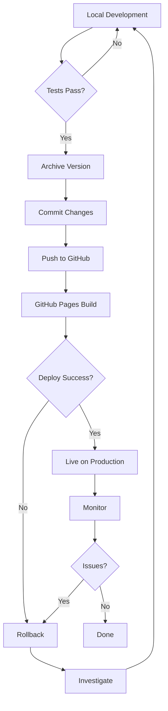

# ChessBlitz Arena - Deployment Guide

**How to Deploy Changes** | Updated: 2025-12-07

---

## Quick Deployment

```bash
# 1. Archive current version
./archive-version.sh

# 2. Commit changes
git add index.html
git commit -m "feat: Your change description"

# 3. Push to GitHub (auto-deploys)
git push origin main

# 4. Verify deployment (wait ~30 seconds)
curl -I https://ammonfife.github.io/ChessBlitzArena/
```

**Done!** GitHub Pages automatically deploys within 30-60 seconds.

---

## Deployment Environments

### Production
- **URL**: https://chess.genomicdigital.com
- **Fallback**: https://ammonfife.github.io/ChessBlitzArena/
- **Branch**: `main`
- **Auto-deploy**: Yes (GitHub Pages)
- **SSL**: Auto (Let's Encrypt via GitHub)

### Stable Fallback
- **URL**: https://chess.genomicdigital.com/last
- **File**: `last.html`
- **Purpose**: Rollback point if latest has issues
- **Updated**: Via `archive-version.sh`

### Version Archive
- **Location**: `versions/` directory
- **Format**: `v{YYYYMMDD_HHMMSS}.html` or `v{version}.html`
- **Purpose**: Historical versions for rollback
- **Access**: https://ammonfife.github.io/ChessBlitzArena/versions/v1.0.0.html

---

## Pre-Deployment Checklist

### Before Every Deployment

```bash
# 1. Run tests
cd ../e2b
python examples/07_chess_blitz_test.py

# 2. Check for errors
grep -i "error\|todo\|fixme" index.html

# 3. Validate HTML (optional)
curl -s -d "out=gnu&doc=index.html&content=$(cat index.html)" \
  https://validator.w3.org/nu/ | head -20

# 4. Archive version
cd ../ChessBlitzArena
./archive-version.sh

# 5. Test locally
open index.html
# Manual testing...

# 6. Commit with clear message
git add index.html
git commit -m "fix: Resolve piece selection bug"

# 7. Push
git push origin main
```

### Major Releases

```bash
# 1. Update version number (in code comments)
# 2. Archive with named version
./archive-version.sh v2.0.0

# 3. Run full test suite
cd ../e2b
python examples/10_chess_ux_async.py
# Wait 5 minutes, check results

# 4. Update README if needed
# 5. Create git tag
git tag -a v2.0.0 -m "Version 2.0.0 - Major feature release"
git push origin v2.0.0

# 6. Create GitHub release
gh release create v2.0.0 --notes "Release notes here"
```

---

## GitHub Pages Configuration

### Current Setup

**Repository Settings** → **Pages**:
- Source: Deploy from branch `main`
- Folder: `/` (root)
- Custom domain: `chess.genomicdigital.com`
- Enforce HTTPS: ✅ Enabled

### Custom Domain Setup

1. **Create CNAME file** (already done):
   ```bash
   echo "chess.genomicdigital.com" > CNAME
   git add CNAME
   git commit -m "chore: Add custom domain"
   git push
   ```

2. **Configure DNS** (already done):
   - Type: CNAME
   - Name: chess
   - Value: ammonfife.github.io
   - TTL: 600

3. **Verify HTTPS**:
   ```bash
   curl -I https://chess.genomicdigital.com
   # Should see HTTP/2 200
   ```

---

## Rollback Procedure

### If Latest Deployment Has Issues

**Option 1: Rollback to /last**
```bash
# Copy last.html to index.html
cp last.html index.html

# Deploy
git add index.html
git commit -m "revert: Rollback to last stable version"
git push origin main
```

**Option 2: Rollback to Specific Version**
```bash
# List available versions
ls -la versions/

# Copy specific version
cp versions/v20251207_161000.html index.html

# Deploy
git add index.html
git commit -m "revert: Rollback to v20251207_161000"
git push origin main
```

**Option 3: Git Revert**
```bash
# Revert last commit
git revert HEAD

# Push
git push origin main
```

### Emergency Rollback

If site is completely broken:

```bash
# 1. Quick rollback
cp last.html index.html
git add index.html
git commit -m "emergency: Rollback to stable"
git push origin main

# 2. Investigate issue
git diff HEAD~1 HEAD

# 3. Fix issue locally
# 4. Test thoroughly
# 5. Deploy fix

# 6. Document incident
echo "$(date): Emergency rollback due to [reason]" >> deployment-log.txt
```

---

## Deployment Workflow



---

## Monitoring Post-Deployment

### Immediate Checks (< 5 minutes)

```bash
# 1. Verify deployment
curl -I https://chess.genomicdigital.com
# Expected: HTTP/2 200

# 2. Check content
curl -s https://chess.genomicdigital.com | grep "<title>"
# Expected: <title>Chess Blitz Arena - Rapid Improvement Trainer</title>

# 3. Test in browser
open https://chess.genomicdigital.com
# Manual smoke test

# 4. Check console for errors
# Open DevTools → Console
# Should see: "Debug console available: chessDebug.getLogs()..."
# No red errors

# 5. Run automated test
cd ../e2b
python examples/07_chess_blitz_test.py
```

### Extended Monitoring (24 hours)

- Check error logs: `chessDebug.getErrors()`
- Monitor user reports (if analytics enabled)
- Check GitHub Issues
- Review Redis captain's log

---

## CI/CD (Future)

### GitHub Actions Workflow

Create `.github/workflows/deploy.yml`:

```yaml
name: Deploy ChessBlitz Arena

on:
  push:
    branches: [main]
  pull_request:
    branches: [main]

jobs:
  test:
    runs-on: ubuntu-latest
    steps:
      - uses: actions/checkout@v3

      - name: Set up Python
        uses: actions/setup-python@v4
        with:
          python-version: '3.11'

      - name: Install dependencies
        run: |
          pip install e2b e2b-code-interpreter playwright
          playwright install chromium

      - name: Run tests
        env:
          E2B_API_KEY: ${{ secrets.E2B_API_KEY }}
          ANTHROPIC_API_KEY: ${{ secrets.ANTHROPIC_API_KEY }}
        run: |
          python ../e2b/examples/07_chess_blitz_test.py

      - name: Comment PR with results
        if: github.event_name == 'pull_request'
        uses: actions/github-script@v6
        with:
          script: |
            github.rest.issues.createComment({
              issue_number: context.issue.number,
              owner: context.repo.owner,
              repo: context.repo.repo,
              body: '✅ Tests passed! Safe to deploy.'
            })

  deploy:
    needs: test
    runs-on: ubuntu-latest
    if: github.ref == 'refs/heads/main'
    steps:
      - uses: actions/checkout@v3

      - name: Archive version
        run: ./archive-version.sh

      - name: Commit archive
        run: |
          git config user.name "GitHub Actions"
          git config user.email "actions@github.com"
          git add versions/ last.html
          git commit -m "chore: Archive version before deploy" || true
          git push

      - name: Deploy to GitHub Pages
        # GitHub Pages deploys automatically on push to main
        run: echo "Deployed!"
```

---

## Version Archiving

### Archive Script Usage

```bash
# Auto-timestamped
./archive-version.sh
# Creates: versions/v20251207_161500.html

# Named version
./archive-version.sh v2.1.0
# Creates: versions/v2.1.0.html

# Both update last.html and create git commit
```

### Archive Policy

- **Before every major change**: Run `./archive-version.sh`
- **Before risky changes**: Named version (e.g., `v2.0.0-pre-refactor`)
- **Weekly snapshots**: Auto-timestamped versions
- **Release versions**: Semantic versioning (v1.0.0, v2.0.0)

### Cleanup Old Archives

```bash
# List archives
ls -lh versions/

# Remove archives older than 90 days (optional)
find versions/ -name "*.html" -mtime +90 -delete

# Keep only last 20 auto-timestamped versions
ls -t versions/v202*.html | tail -n +21 | xargs rm
```

---

## Deployment Best Practices

1. **Always archive before major changes**
2. **Test locally first**
3. **Run automated tests**
4. **Deploy during low-traffic times**
5. **Monitor for 24 hours post-deploy**
6. **Keep /last version stable**
7. **Document significant changes**
8. **Use semantic versioning for releases**
9. **Communicate breaking changes**
10. **Have rollback plan ready**

---

## Troubleshooting

### Deployment Not Updating

```bash
# Clear GitHub Pages cache
# Go to repo Settings → Pages → "Your site is live at..."
# Click the URL, hard refresh (Cmd+Shift+R)

# Check build status
gh run list --workflow=pages-build-deployment

# Force rebuild (push empty commit)
git commit --allow-empty -m "chore: Force rebuild"
git push
```

### Custom Domain Not Working

```bash
# Verify DNS
dig chess.genomicdigital.com CNAME +short
# Should show: ammonfife.github.io

# Check CNAME file
cat CNAME
# Should contain: chess.genomicdigital.com

# Verify HTTPS certificate
curl -vI https://chess.genomicdigital.com 2>&1 | grep "SSL certificate"
```

### 404 Errors

```bash
# Check file exists in repo
ls -la index.html

# Verify GitHub Pages is enabled
gh repo view --web
# Go to Settings → Pages

# Check branch/folder settings
# Should be: main branch, / (root) folder
```

---

## Contact

Questions about deployment? Check:
- [DEVELOPMENT.md](DEVELOPMENT.md) - Development workflow
- [QUICKSTART.md](QUICKSTART.md) - Getting started
- [GitHub Issues](https://github.com/ammonfife/ChessBlitzArena/issues)

---

**Happy deploying!** 🚀
