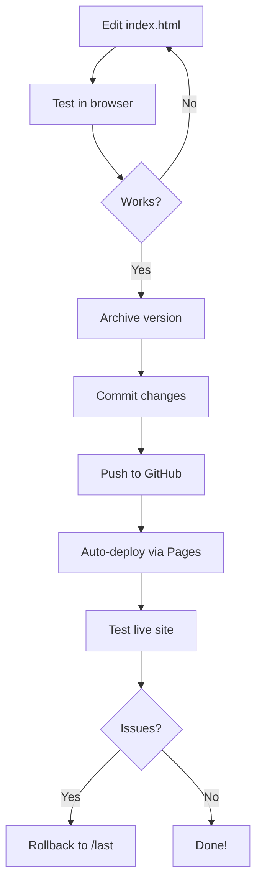

# ChessBlitz Arena - Quick Start Guide

**For Developers** | Updated: 2025-12-07

---

## Getting Started in 2 Minutes

### 1. View the Live Site
```bash
open https://ammonfife.github.io/ChessBlitzArena/
# or
open http://chess.genomicdigital.com
```

### 2. Local Development
```bash
# Clone the repo
git clone https://github.com/ammonfife/ChessBlitzArena.git
cd ChessBlitzArena

# Open in browser
open index.html

# That's it! No build step needed.
```

### 3. Make Changes
```bash
# Edit the single file
code index.html  # or your editor of choice

# Refresh browser to see changes
# (Cmd+R or F5)
```

---

## Project Structure

```
ChessBlitzArena/
├── index.html              # THE ENTIRE APP (2499 lines)
├── last.html              # Previous stable version
├── CNAME                  # Custom domain config
│
├── versions/              # Archived versions
│   ├── README.md
│   └── v*.html
│
├── archive-version.sh     # Version archiving script
│
└── Documentation/
    ├── README.md                      # Overview
    ├── UserExperienceRequirements.md  # UX spec
    ├── TESTING_STATUS.md              # Test dashboard
    ├── TICKETS.md                     # Issue tracker
    ├── QUICKSTART.md                  # This file
    ├── DEVELOPMENT.md                 # Dev guide
    ├── DEPLOYMENT.md                  # Deploy guide
    └── API.md                         # JavaScript API docs
```

---

## Single-File Architecture

**Everything is in `index.html`:**
- HTML structure
- CSS styles (in `<style>` tag)
- JavaScript logic (in `<script>` tag)
- Embedded data (puzzle sets)

**Why single-file?**
- ✅ Zero build step
- ✅ Easy to deploy
- ✅ Fast development
- ✅ Simple version control
- ✅ Works offline after first load

**Trade-off**: Large file (2499 lines), but well-organized with clear sections.

---

##

 Key Sections in index.html

| Lines | Section | Description |
|-------|---------|-------------|
| 1-50 | HTML Structure | Body, containers, UI elements |
| 51-600 | CSS Styles | All styling, animations, themes |
| 601-1149 | Puzzle Data | Hardcoded puzzle sets by rating |
| 1150-1281 | Logger Class | Comprehensive logging system |
| 1282-1327 | Global Variables | Game state, constants |
| 1328-1423 | AIEngine Class | Stockfish integration |
| 1424-1650 | Game Logic | Core chess mechanics |
| 1651-1703 | Board Rendering | Visual board display |
| 1704-1850 | User Interaction | Click handlers, moves |
| 1851-2100 | Gamification | XP, levels, streaks |
| 2101-2300 | Power-ups | Hint, freeze, skip, 2x |
| 2301-2450 | UI Updates | Animations, notifications |
| 2451-2499 | Initialization | DOMContentLoaded, setup |

---

## Common Tasks

### Add a New Feature
1. Find relevant section in index.html
2. Add HTML if needed (lines 1-50)
3. Add CSS if needed (lines 51-600)
4. Add JavaScript logic
5. Test in browser
6. Archive version before committing

### Fix a Bug
1. Check TICKETS.md for known issues
2. Find code location (use line numbers)
3. Make fix
4. Test manually
5. Run E2B tests if available
6. Commit with descriptive message

### Archive Current Version
```bash
# Before major changes
./archive-version.sh v2.1.0

# Auto-timestamped
./archive-version.sh

# This creates:
# - versions/v2.1.0.html
# - last.html (rollback point)
# - Git commit
```

### Deploy to Production
```bash
# Commit changes
git add index.html
git commit -m "feat: Add new feature"

# Push to GitHub (auto-deploys via GitHub Pages)
git push origin main

# Verify deployment
curl -I https://ammonfife.github.io/ChessBlitzArena/
```

---

## Testing

### Manual Testing
```bash
# Open in browser
open index.html

# Test checklist:
# - [ ] Site loads
# - [ ] Start assessment works
# - [ ] Pieces selectable
# - [ ] Moves validate correctly
# - [ ] XP/level updates
# - [ ] Power-ups work
# - [ ] Board skins apply
# - [ ] LocalStorage persists
```

### Automated Testing
```bash
# Run basic functionality tests
cd ../e2b
python examples/07_chess_blitz_test.py

# Run async UX evaluation
python examples/10_chess_ux_async.py

# Check results in 5 minutes
python -c "from e2b_code_interpreter import Sandbox; s=Sandbox.connect('SANDBOX_ID'); print(s.commands.run('cat /home/user/EVALUATION_SUMMARY.txt').stdout)"
```

### Debug Console
Open DevTools console and use:
```javascript
// View all logs
chessDebug.getLogs()

// View errors only
chessDebug.getErrors()

// Export logs
chessDebug.exportLogs()

// View game state
chessDebug.showStats()

// Get AI analysis
chessDebug.getAIAnalysis()
```

---

## External Dependencies

Only 2 external dependencies (loaded from CDN):

1. **Chess.js** - Move validation
   ```html
   <script src="https://cdn.jsdelivr.net/npm/chess.js@1.0.0/chess.min.js"></script>
   ```

2. **Stockfish.js** - AI engine for hints
   ```html
   <script src="https://cdn.jsdelivr.net/npm/stockfish.js/stockfish.js"></script>
   ```

**All other code is self-contained in index.html**

---

## Key Technologies

- **Vanilla JavaScript** - No framework
- **CSS3** - Modern animations, glassmorphism
- **LocalStorage** - Persistence
- **Web Workers** - Stockfish runs in background
- **GitHub Pages** - Free hosting
- **Custom Domain** - chess.genomicdigital.com

---

## Development Workflow



---

## Useful Commands

```bash
# Start local Python server (if needed)
python3 -m http.server 8000
open http://localhost:8000

# Check file size
wc -l index.html
du -h index.html

# Search for function
grep -n "function renderBoard" index.html

# Count lines by section
sed -n '1,50p' index.html | wc -l  # HTML
sed -n '51,600p' index.html | wc -l  # CSS
sed -n '601,2499p' index.html | wc -l  # JS

# View git history
git log --oneline --graph

# Compare with last version
diff index.html last.html
```

---

## Getting Help

1. **Check Documentation**:
   - README.md - Project overview
   - UserExperienceRequirements.md - UX spec
   - TICKETS.md - Known issues
   - API.md - JavaScript API reference

2. **Debug Console**:
   - Use `chessDebug.*` methods
   - Check browser console for errors

3. **Testing**:
   - Run E2B tests
   - Check TESTING_STATUS.md

4. **Redis Logs**:
   ```bash
   redis-cli -p 6379 LRANGE "captains_log" 0 10
   redis-cli -p 6379 GET "chess_blitz:tickets:summary"
   ```

---

## Next Steps

- Read [DEVELOPMENT.md](DEVELOPMENT.md) for detailed dev guide
- Read [DEPLOYMENT.md](DEPLOYMENT.md) for deployment process
- Review [UserExperienceRequirements.md](UserExperienceRequirements.md) for UX standards
- Check [TICKETS.md](TICKETS.md) for work items

---

**Happy coding!** 🚀♟️
